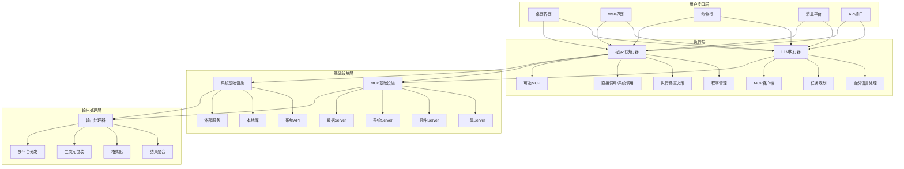
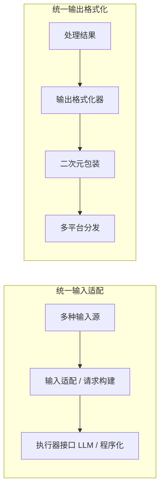
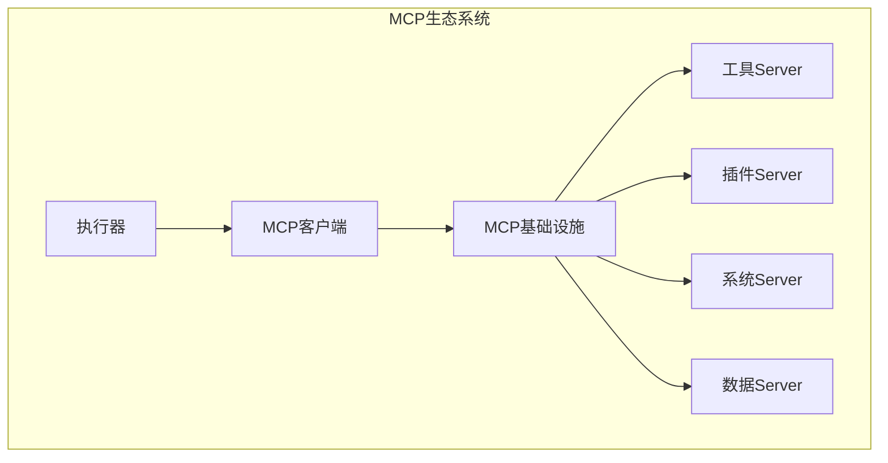
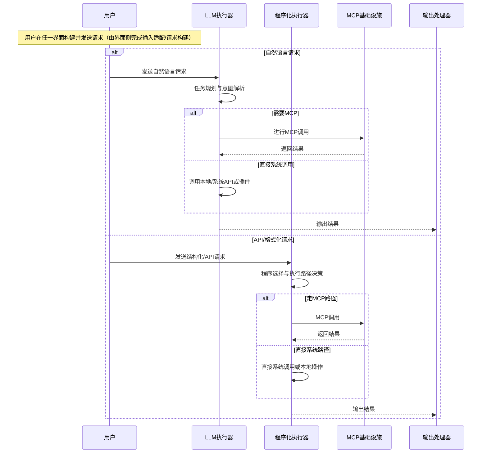
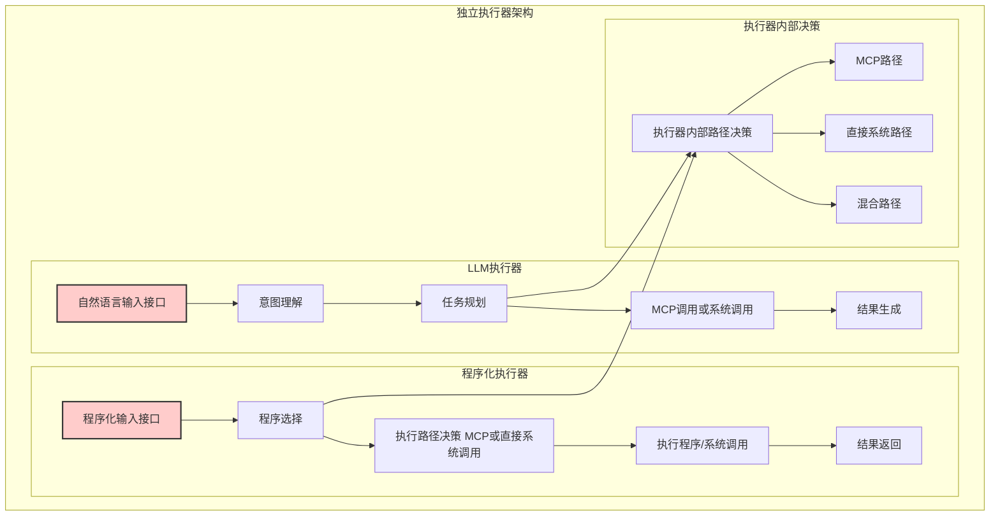
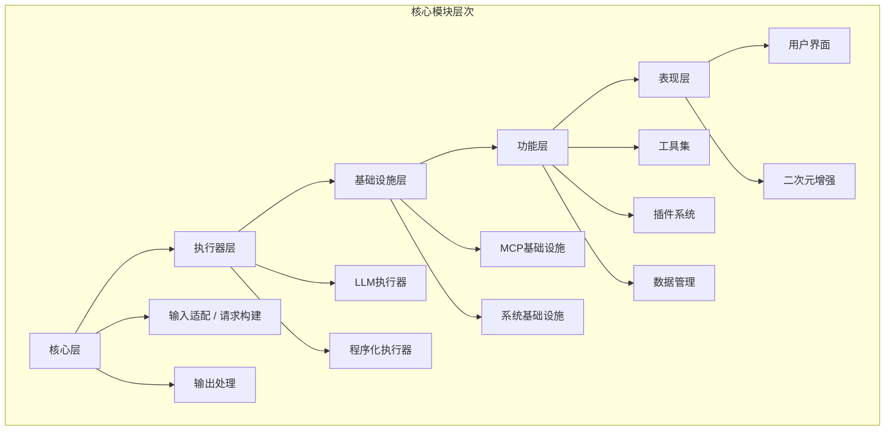
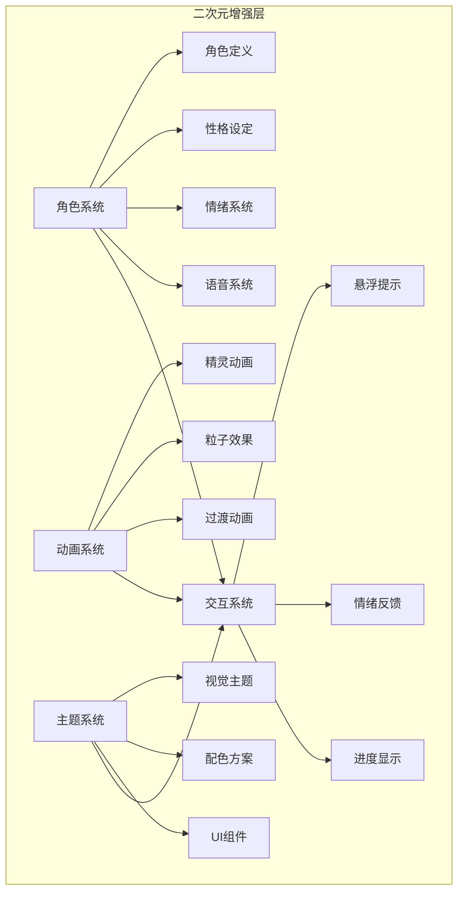
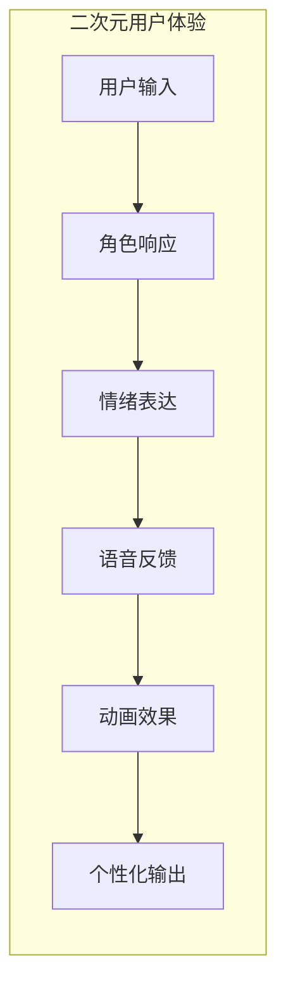
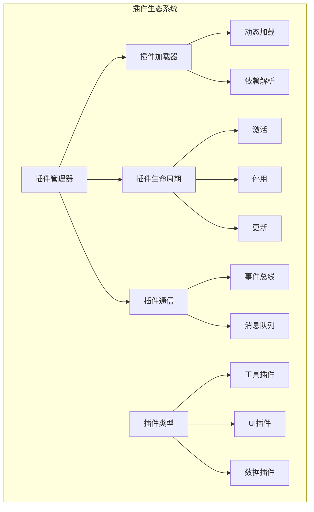
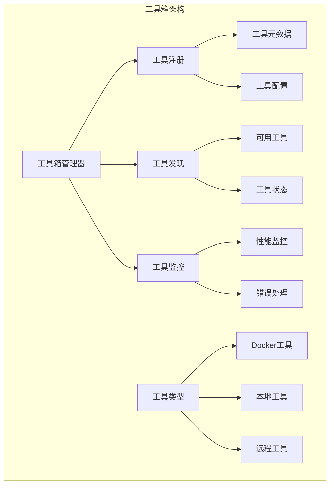

# Super-Chan（苏帕酱）AI桌面助手设计文档

## 📋 文档信息

| 项目名称 | Super-Chan（苏帕酱）AI桌面助手 |
| -------- | ------------------------------ |
| 文档版本 | v1.0                           |
| 创建日期 | 2024年                         |
| 文档类型 | 架构设计文档                   |

---

## 🎯 项目目标与愿景

### 项目愿景

创建一个具有二次元风格的智能AI桌面助手，能够通过自然语言和程序化接口为用户提供邮件管理、桌面操作、任务调度等智能化服务，打造既实用又富有个性化的数字助手体验。

### 核心目标

1. **智能化交互**：支持自然语言和格式化API两种输入方式
2. **功能聚合**：集成邮件处理、桌面操作、任务调度等实用功能
3. **二次元风格**：提供富有动漫特色的用户界面和交互体验
4. **模块化架构**：支持功能插拔和扩展
5. **多平台支持**：统一桌面、Web、命令行、消息平台的用户体验

---

## 🏗️ 架构设计概述

### 整体架构理念

Super-Chan采用分层模块化架构，通过双执行器模式实现不同类型输入的独立处理。各输入界面负责构建统一请求并直接发送到执行层（执行器）。执行器分别暴露针对自然语言请求与格式化/API请求的接收接口，从而无需独立路由组件即可完成请求处理与执行路径决策。

### 核心架构组件



---

## 🧠 核心设计理念

### 1. 双执行器模式

采用两个独立的执行器处理不同类型的输入，确保各自的最优性能：

- **LLM执行器**：专门处理自然语言输入，具备智能推理和任务规划能力，通过 LLM 执行器的自然语言接口接收用户请求
- **程序化执行器**：处理格式化API请求，提供高效的直接执行能力，通过程序化执行器的程序化接口接收结构化请求

### 2. 统一输入输出

通过标准化的接口实现多平台统一的输入输出体验。各输入界面负责将用户行为适配为标准请求并直接发送到对应执行器接口；不存在独立的中间路由器组件，执行器在内部完成必要的类型判断与执行路径决策。



### 3. MCP协议集成

所有核心功能通过MCP（Model Context Protocol）协议暴露，确保模块间的标准化通信：



---

## 📐 详细架构设计

### 系统数据流



### 执行器协作模式



---

## 📁 项目结构设计

### 顶层目录结构

```
super-chan/
├── config/                    # 配置管理
├── src/                       # 源代码
│   ├── core/                 # 核心模块
│   ├── executors/            # 执行器
│   ├── mcp/                  # MCP基础设施
│   ├── mcp_servers/          # MCP Server实现
│   ├── tools/                # 工具模块
│   ├── plugins/              # 插件系统
│   ├── ui/                   # 用户界面
│   ├── anime/                # 二次元增强
│   ├── database/             # 数据存储
│   ├── utils/                # 工具函数
│   └── docker/               # Docker相关
├── tests/                    # 测试
├── docs/                     # 文档
├── scripts/                  # 脚本
└── examples/                 # 示例
```

### 核心模块组织



---

## 🎨 二次元风格设计

### 角色系统架构



### 用户体验设计



---

## 🔧 关键设计决策

### 1. 执行器分离决策

- **决策**：采用双执行器而非单一执行器
- **理由**：自然语言处理和程序化执行具有不同的性能特征和需求
- **优势**：各自优化，避免相互干扰，提高整体性能

### 2. MCP协议采用

- **决策**：所有功能通过MCP协议暴露
- **理由**：标准化接口，支持模块化开发，便于扩展
- **优势**：统一的通信协议，支持动态加载和卸载

### 3. 程序化执行器灵活性

- **决策**：程序化执行器可选择是否使用MCP
- **理由**：某些场景下直接调用更高效
- **优势**：灵活性最大化，性能优化空间大

### 4. 二次元风格集成

- **决策**：将二次元风格作为核心设计元素
- **理由**：差异化竞争，提升用户体验
- **优势**：独特的品牌识别，增强用户粘性

---

## 🚀 扩展性设计

### 插件系统架构



### 工具箱设计



---

## 📊 系统特性总结

### 核心特性

1. **双执行器架构**：自然语言和API请求独立处理
2. **统一输入输出**：多平台一致的用户体验，界面侧负责构建请求并直接发送到执行器
3. **MCP协议集成**：标准化的模块间通信
4. **二次元风格**：独特的视觉和交互体验
5. **模块化设计**：高度可扩展的架构

### 技术特性

1. **异步处理**：支持高并发请求处理
2. **容器化支持**：Docker工具集成
3. **插件系统**：支持第三方扩展
4. **多模态输出**：文本、语音、动画等多种输出形式
5. **配置驱动**：灵活的配置管理系统

### 用户体验特性

1. **自然交互**：支持自然语言对话
2. **个性化**：二次元角色和情绪反馈
3. **多平台**：桌面、Web、移动端全覆盖
4. **实时响应**：快速的任务执行和反馈
5. **直观操作**：简单易用的用户界面

---

## 🎯 项目里程碑

### 第一阶段：核心架构

- [ ] 完成基础架构设计
- [ ] 实现输入适配与执行器接收接口
- [ ] 实现双执行器框架
- [ ] 搭建MCP基础设施

### 第二阶段：功能实现

- [ ] 邮件处理功能
- [ ] 桌面操作功能
- [ ] 任务调度功能
- [ ] 基础UI实现

### 第三阶段：二次元增强

- [ ] 角色系统集成
- [ ] 语音系统实现
- [ ] 动画效果添加
- [ ] 主题系统完善

### 第四阶段：生态扩展

- [ ] 插件系统完善
- [ ] 工具箱功能扩展
- [ ] 社区插件支持
- [ ] 文档和示例完善

---

## 📝 设计原则

### 1. 简单性原则

- 保持架构简洁明了
- 避免过度设计
- 优先考虑可维护性

### 2. 模块化原则

- 高内聚，低耦合
- 清晰的模块边界
- 标准化的接口设计

### 3. 可扩展性原则

- 支持功能动态扩展
- 预留未来升级空间
- 兼容第三方集成

### 4. 用户体验原则

- 以用户为中心的设计
- 一致性的交互体验
- 个性化和定制化支持

### 5. 性能原则

- 响应速度优先
- 资源使用优化
- 并发处理能力

---

## 🔒 安全与隐私考虑

### 数据安全

- 用户数据加密存储
- 敏感信息脱敏处理
- 安全的通信协议

### 访问控制

- 基于角色的权限管理
- API访问认证
- 操作日志记录

### 隐私保护

- 最小化数据收集
- 用户隐私设置
- 数据本地化存储

---

---

本设计文档概述了Super-Chan项目的整体架构和设计理念，为后续的开发实施提供了清晰的指导方向。已移除独立的“输入路由/输入路由器/路径选择器”概念；各界面负责构建请求并直接发送到执行器，执行器在内部完成路径决策与MCP或直接系统调用的选择。
