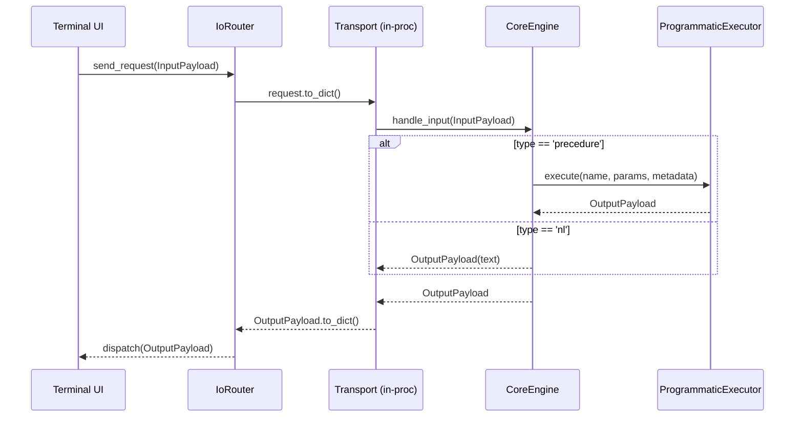

# Core 程序化执行器与 IO Router 交互方案

本文描述 Core 层“程序化执行器”的实现与 UI/IoRouter 的交互契约，提供最小可运行示例（echo）。

## 组件与职责

- IoRouter（已有）：
  - 接收 UI 层构造的 `InputPayload`，序列化为 `dict` 交给 transport；
  - 获取 transport 返回的 `dict`，反序列化为 `OutputPayload` 并分发给已注册回调（如 Terminal UI）。
- CoreEngine（新增）：
  - 统一入口 `handle_input(InputPayload) -> OutputPayload`；
  - 按 `payload.type` 路由：`precedure` 交给程序化执行器，`nl` 做最小回显（可替换为对话 Agent）。
- ProgrammaticExecutor（新增）：
  - 基于注册表的程序化执行器，`register(name, async_func)` 与 `execute(name, params, metadata)`；
  - 过程函数与 `execute` 均返回 `OutputPayload`（统一约定，便于上下游对齐）。
- Transport 适配器（新增）：
  - `make_inprocess_transport(engine)` 将 CoreEngine 暴露为 IoRouter 所需的异步 transport（进程内调用）。

## 契约（Contract）

- InputPayload
  - `type`: `"nl" | "precedure"`
  - `input`: 当 `nl` 为 `str`；当 `precedure` 为 `dict[str, Any]`
  - `metadata`: 任意字典；当 `type == 'precedure'` 时推荐包含 `procedure` 字段指定过程名

- OutputPayload
  - `type`: `"text" | "dict"`
  - `output`: 对应上面的类型；当为 `dict` 时，UI 会优先展示 `output['text']`
  - `timestamp/metadata`: 可选，Core 默认注入 `{"source": "core"}`

## 流程（顺序）

1. Terminal UI 构造 `InputPayload` 并调用 `IoRouter.send_request()`
2. IoRouter 将 `request.to_dict()` 传给 transport
3. transport（in-process）转换为 `InputPayload` 并调用 `CoreEngine.handle_input()`
4. CoreEngine：
   - `type == 'precedure'`：读取 `metadata['procedure']`，转交 ProgrammaticExecutor
   - `type == 'nl'`：最小回显（可替换）
5. ProgrammaticExecutor 执行对应异步函数，返回结果；Core 归一化为 `OutputPayload`
6. transport 返回 `dict`；IoRouter 构造 `OutputPayload` 并分发给 UI 回调

## 最小示例：echo

- 配置：`config/procedure/echo.toml`
- 执行器：`ProgrammaticExecutor` 内置注册 `echo` 过程（`build_default_programmatic_executor`）。
- 运行：
  - 打开命令面板（Textual 默认 key），输入 `procedure echo`，填写 `text` 与可选 `time_delay` 提交；
  - 或在输入框直接发任意文本作为 `nl` 请求，Core 会回显。

## 扩展与错误模式

- 新增 procedure：调用 `ProgrammaticExecutor.register(name, async_func)` 即可；在函数内校验参数并返回 `dict` 或 `OutputPayload`。
- 错误返回：Core 约定以 `OutputPayload(type='dict', output={'text': '...', 'error': 'code'})` 统一对外；UI 将展示 `text`。
- 取消/超时：可以在 ProgrammaticExecutor 内部增加超时包装，或在 CoreEngine 增加超时策略。
