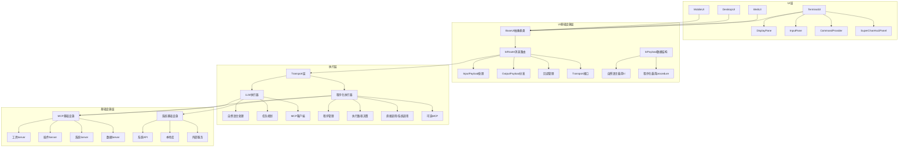
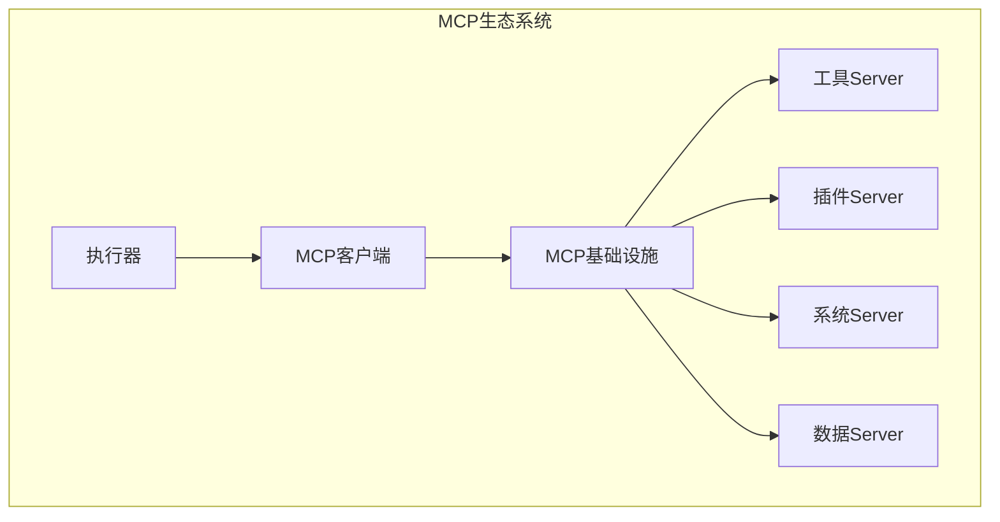
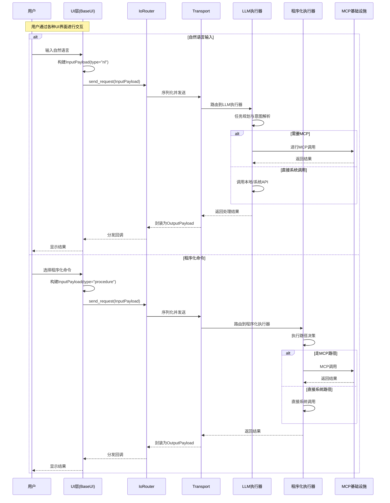

# 核心架构模块

## 📋 文档信息

| 项目名称 | Super-Chan（苏帕酱）AI桌面助手 |
| -------- | ------------------------------ |
| 文档版本 | v1.0                           |
| 创建日期 | 2024年                         |
| 文档类型 | 架构设计文档                   |

---

## 🎯 项目目标与愿景

### 项目愿景

创建一个具有二次元风格的智能AI桌面助手，能够通过自然语言和程序化接口为用户提供邮件管理、桌面操作、任务调度等智能化服务，打造既实用又富有个性化的数字助手体验。

### 核心目标

1. **智能化交互**：支持自然语言和格式化API两种输入方式
2. **功能聚合**：集成邮件处理、桌面操作、任务调度等实用功能
3. **二次元风格**：提供富有动漫特色的用户界面和交互体验
4. **模块化架构**：支持功能插拔和扩展
5. **多平台支持**：统一桌面、Web、命令行、消息平台的用户体验

---

## 🏗️ 架构设计概述

### 整体架构理念

Super-Chan采用分层模块化架构，通过IoRouter中间层实现UI与后端的解耦。UI层基于抽象BaseUI类构建不同界面实现，通过统一的IoPayload数据结构与IoRouter进行通信。IoRouter负责消息路由、格式转换和回调分发，连接UI层与后端执行器。

### 核心架构组件



---

## 🧠 核心设计理念

### 1. 双执行器模式

采用两个独立的执行器处理不同类型的输入，确保各自的最优性能：

- **LLM执行器**：专门处理自然语言输入，具备智能推理和任务规划能力，通过 LLM 执行器的自然语言接口接收用户请求
- **程序化执行器**：处理格式化API请求，提供高效的直接执行能力，通过程序化执行器的程序化接口接收结构化请求

### 2. 基于IoRouter的分层架构

采用IoRouter作为UI与后端之间的中间层，实现清晰的职责分离：

- **UI层**：继承BaseUI抽象类，专注于用户交互和界面呈现，通过标准化的IoPayload与IoRouter通信
- **IoRouter**：负责消息路由、数据格式转换、回调管理和Transport接口
- **执行层**：通过Transport接口接收处理请求，包含LLM执行器和程序化执行器

### 3. 统一载荷数据结构

通过标准化的IoPayload实现UI与后端的数据交换。支持两种输入类型和统一的输出格式：

```mermaid
graph LR
    subgraph 输入载荷InputPayload
        A[type: "nl"] --> A1[自然语言文本]
        B[type: "procedure"] --> B1[结构化命令]
    end
    subgraph 输出载荷OutputPayload
        C[type: "text"] --> C1[文本输出]
        D[type: "dict"] --> D1[结构化输出]
    end
    subgraph IoRouter处理
        E[载荷转换] --> F[Transport发送]
        F --> G[回调分发]
    end
```

### 3. MCP协议集成

所有核心功能通过MCP（Model Context Protocol）协议暴露，确保模块间的标准化通信：



---

## 📐 详细架构设计

### 系统数据流



---

## 🔧 关键设计决策

### 1. UI层分层架构决策

- **决策**：采用BaseUI抽象基类 + IoRouter中间层的分层架构
- **理由**：实现UI与后端的解耦，支持多种UI实现，提供统一的数据交换接口
- **优势**：高度可扩展，支持异步通信，便于测试和维护

### 2. IoPayload载荷设计决策

- **决策**：设计统一的InputPayload和OutputPayload数据结构
- **理由**：标准化UI与后端的数据交换格式，支持序列化和网络传输
- **优势**：类型安全，支持向后兼容，便于调试和日志记录

### 3. 执行器分离决策

- **决策**：采用双执行器而非单一执行器
- **理由**：自然语言处理和程序化执行具有不同的性能特征和需求
- **优势**：各自优化，避免相互干扰，提高整体性能

### 2. MCP协议采用

- **决策**：所有功能通过MCP协议暴露
- **理由**：标准化接口，支持模块化开发，便于扩展
- **优势**：统一的通信协议，支持动态加载和卸载

### 3. 程序化执行器灵活性

- **决策**：程序化执行器可选择是否使用MCP
- **理由**：某些场景下直接调用更高效
- **优势**：灵活性最大化，性能优化空间大

### 4. 二次元风格集成

- **决策**：将二次元风格作为核心设计元素
- **理由**：差异化竞争，提升用户体验
- **优势**：独特的品牌识别，增强用户粘性

---

## 📊 系统特性总结

### 核心特性

1. **分层UI架构**：BaseUI抽象基类 + IoRouter中间层 + 具体UI实现的三层架构
2. **标准化载荷**：InputPayload/OutputPayload统一数据交换格式，支持nl和procedure两种输入类型
3. **异步消息路由**：IoRouter实现非阻塞的消息路由和回调分发
4. **MCP协议集成**：标准化的模块间通信
5. **二次元风格**：独特的视觉和交互体验，包含ASCII动画和主题化界面
6. **模块化设计**：高度可扩展的架构，支持新UI类型和组件扩展

### 技术特性

1. **异步处理**：支持高并发请求处理
2. **容器化支持**：Docker工具集成
3. **插件系统**：支持第三方扩展
4. **多模态输出**：文本、语音、动画等多种输出形式
5. **配置驱动**：灵活的配置管理系统

### 用户体验特性

1. **双模式交互**：支持自然语言输入和程序化命令两种交互方式
2. **实时视觉反馈**：ASCII动画角色提供状态提示和情绪反馈
3. **命令面板支持**：Ctrl+P快速访问程序化命令，支持表单化参数输入
4. **多行输入体验**：支持Ctrl+Enter发送，Enter换行的现代化输入体验
5. **异步响应处理**：非阻塞的消息处理，界面始终保持响应
6. **可扩展界面**：支持多种UI实现，统一的用户体验

---

## 🎯 项目里程碑

### 第一阶段：核心架构 ✅

- [x] 完成UI层分层架构设计
- [x] 实现BaseUI抽象基类和IoRouter
- [x] 实现InputPayload/OutputPayload载荷系统
- [x] 实现TerminalUI基础框架

### 第二阶段：UI功能实现 ✅

- [x] TerminalUI主界面实现
- [x] 消息显示和输入组件
- [x] ASCII动画角色系统
- [x] 程序化命令提供者和表单界面

### 第三阶段：功能扩展

- [ ] 邮件处理功能
- [ ] 桌面操作功能
- [ ] 任务调度功能
- [ ] WebUI和DesktopUI实现

### 第四阶段：二次元增强

- [ ] 角色系统集成
- [ ] 语音系统实现
- [ ] 动画效果添加
- [ ] 主题系统完善

### 第四阶段：生态扩展

- [ ] 插件系统完善
- [ ] 工具箱功能扩展
- [ ] 社区插件支持
- [ ] 文档和示例完善

---

## � 当前实现状态

### UI层实现现状

项目当前已完成UI层的核心架构实现，具体包括：

#### ✅ 已完成的组件

1. **BaseUI抽象基类** (`superchan/ui/base_ui.py`)
   - 定义了UI与IoRouter的标准接口
   - 提供回调注册和生命周期管理
   - 支持异步消息处理

2. **IoRouter消息路由系统** (`superchan/ui/io_router.py`)
   - 实现Transport接口和回调分发
   - 支持同步和异步回调
   - 提供错误处理和异常日志

3. **载荷数据结构** (`superchan/ui/io_payload.py`)
   - InputPayload支持nl和procedure两种类型
   - OutputPayload支持text和dict两种输出
   - 完整的序列化和向后兼容支持

4. **TerminalUI完整实现** (`superchan/ui/terminal/terminal_ui.py`)
   - 基于Textual框架的现代终端界面
   - DisplayPane消息显示和InputPane多行输入
   - SuperChanAsciiPanel动画角色系统
   - 完整的键盘绑定和事件处理

5. **程序化命令系统** (`superchan/ui/terminal/command_provider.py`)
   - ProcedureCommands集成到Textual命令面板
   - ProcedureFormScreen表单对话框
   - 支持从TOML配置文件动态加载命令

#### 🚧 开发中的功能

- Transport后端接口（目前使用模拟实现）
- WebUI和DesktopUI具体实现
- 更丰富的ASCII动画状态
- 主题和配色系统

#### 🎯 架构优势

当前实现体现了以下设计优势：

1. **高度模块化**：各组件职责清晰，易于测试和维护
2. **异步优先**：全面的异步支持，保证界面响应性
3. **可扩展性**：新UI类型只需继承BaseUI即可快速实现
4. **类型安全**：完整的类型注解和运行时验证
5. **错误恢复**：全面的异常处理和优雅降级

---

## �📝 设计原则

### 1. 简单性原则

- 保持架构简洁明了
- 避免过度设计
- 优先考虑可维护性

### 2. 模块化原则

- 高内聚，低耦合
- 清晰的模块边界
- 标准化的接口设计

### 3. 可扩展性原则

- 支持功能动态扩展
- 预留未来升级空间
- 兼容第三方集成

### 4. 用户体验原则

- 以用户为中心的设计
- 一致性的交互体验
- 个性化和定制化支持

### 5. 性能原则

- 响应速度优先
- 资源使用优化
- 并发处理能力

---

## 🔒 安全与隐私考虑

### 数据安全

- 用户数据加密存储
- 敏感信息脱敏处理
- 安全的通信协议

### 访问控制

- 基于角色的权限管理
- API访问认证
- 操作日志记录

### 隐私保护

- 最小化数据收集
- 用户隐私设置
- 数据本地化存储

---