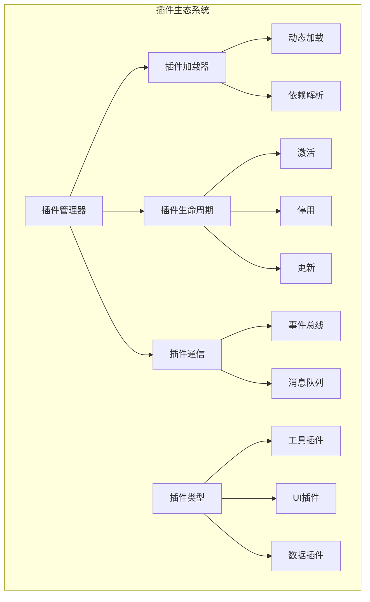
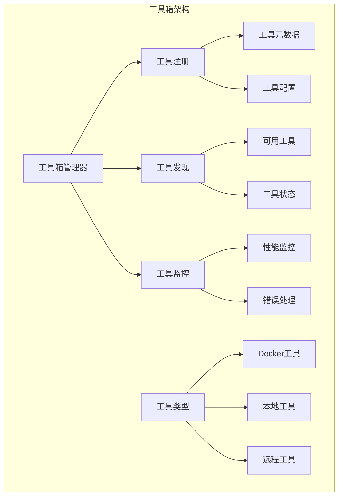

# 扩展性设计模块

## 🚀 扩展性设计

### 插件系统架构

```mermaid
graph TB
    subgraph "插件生态系统"
        A[插件管理器]
        A --> B[插件加载器]
        A --> C[插件生命周期]
        A --> D[插件通信]

        B --> B1[动态加载]
        B --> B2[依赖解析]

        C --> C1[激活]
        C --> C2[停用]
        C --> C3[更新]

        D --> D1[事件总线]
        D --> D2[消息队列]

        E[插件类型]
        E --> E1[工具插件]
        E --> E2[UI插件]
        E --> E3[数据插件]
    end
```

### 工具箱设计

```mermaid
graph TB
    subgraph "工具箱架构"
        A[工具箱管理器]
        A --> B[工具注册]
        A --> C[工具发现]
        A --> D[工具监控]

        B --> B1[工具元数据]
        B --> B2[工具配置]

        C --> C1[可用工具]
        C --> C2[工具状态]

        D --> D1[性能监控]
        D --> D2[错误处理]

        E[工具类型]
        E --> E1[Docker工具]
        E --> E2[本地工具]
        E --> E3[远程工具]
    end
```