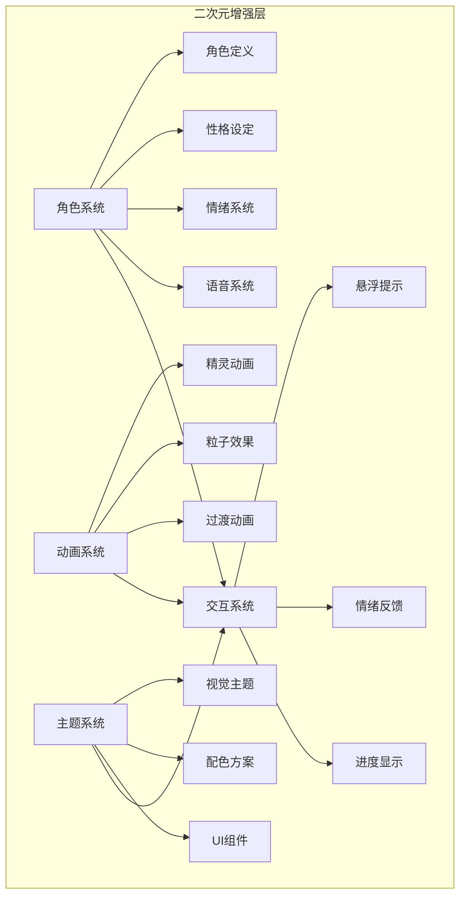
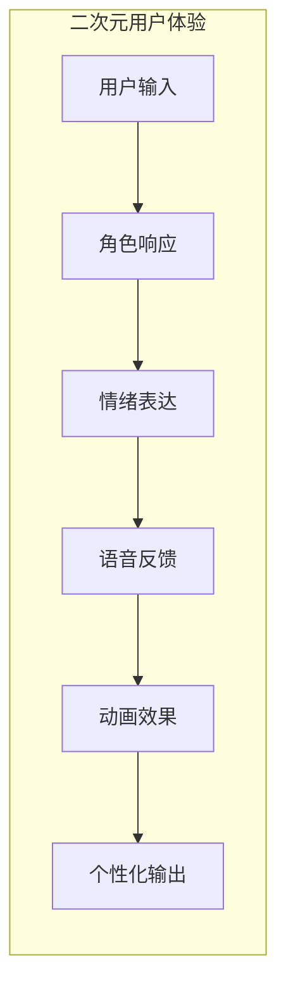

# 二次元风格模块

## 🎨 二次元风格设计

### 角色系统架构

```mermaid
graph TB
    subgraph "二次元增强层"
        A[角色系统]
        A --> A1[角色定义]
        A --> A2[性格设定]
        A --> A3[情绪系统]
        A --> A4[语音系统]

        B[动画系统]
        B --> B1[精灵动画]
        B --> B2[粒子效果]
        B --> B3[过渡动画]

        C[主题系统]
        C --> C1[视觉主题]
        C --> C2[配色方案]
        C --> C3[UI组件]

        D[交互系统]
        D --> D1[悬浮提示]
        D --> D2[情绪反馈]
        D --> D3[进度显示]
    end

    A --> D
    B --> D
    C --> D
```

### 用户体验设计

```mermaid
graph LR
    subgraph "二次元用户体验"
        A[用户输入] --> B[角色响应]
        B --> C[情绪表达]
        C --> D[语音反馈]
        D --> E[动画效果]
        E --> F[个性化输出]
    end
```