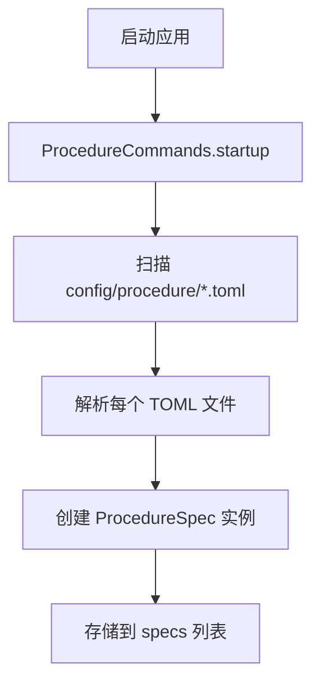
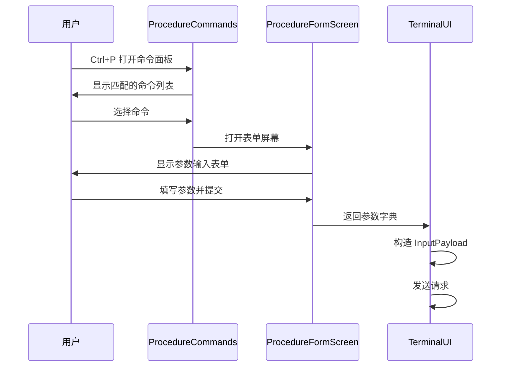

# CommandProvider 命令提供者

CommandProvider 负责扫描配置目录、加载程序化命令定义，并将其集成到 Textual 的命令系统中。

## 功能概述

- **配置扫描**：自动扫描 `config/procedure/*.toml` 文件
- **命令注册**：将每个配置注册为 Textual 命令
- **表单界面**：提供参数收集的模态表单
- **类型转换**：支持多种数据类型的输入验证和转换

## 配置格式

### TOML 结构

```toml
[command]
name = "query_user"
description = "查询用户信息"

[input]
user_id = "int"
include_details = "bool"

[output]
user_info = "dict"
status = "str"

[metadata]
category = "user_management"
```

### 支持的类型

- **str/string/text**：字符串输入
- **int/integer**：整数输入
- **float/number**：浮点数输入
- **bool/boolean**：布尔值输入

## 核心类

### ProcedureSpec

命令规范数据类：

```python
@dataclass
class ProcedureSpec:
    name: str
    description: str
    input_schema: dict[str, str]  # 字段名 -> 类型
    metadata: dict[str, Any]
    output_spec: dict[str, str]   # 输出字段 -> 类型
    file_path: Path
```

### ProcedureFormScreen

参数收集表单屏幕：

- **模态界面**：半透明遮罩 + 居中对话框
- **动态字段**：根据配置生成输入控件
- **实时验证**：输入时进行类型转换
- **键盘导航**：Tab 切换，Ctrl+Enter 提交

### ProcedureCommands

Textual 命令提供者：

- **异步扫描**：启动时扫描配置目录
- **命令匹配**：支持模糊匹配和排序
- **表单集成**：选择命令后打开参数表单

## 工作流程

### 命令加载



### 命令执行



## 类型转换

### 转换逻辑

```python
def _cast_value(value: str, typ: str) -> Any:
    t = typ.strip().lower()
    if t in ("str", "string", "text"):
        return value
    if t in ("int", "integer"):
        return int(value)
    if t in ("float", "number"):
        return float(value)
    if t in ("bool", "boolean"):
        v = value.strip().lower()
        if v in ("true", "1", "yes", "y", "on"):
            return True
        if v in ("false", "0", "no", "n", "off"):
            return False
        return value
    return value
```

### 错误处理

- **转换失败**：返回原字符串值
- **用户提示**：在界面上标红显示转换错误
- **日志记录**：记录详细的转换异常信息

## 样式定义

### CSS 样式

```css
ProcedureFormScreen {
    background: rgba(0,0,0,0.6);
}

#dialog {
    width: 70%;
    height: 60%;
    background: $panel;
    border: heavy $primary;
    padding: 1 2;
}

.form-row {
    layout: horizontal;
    height: auto;
    padding: 0 0 1 0;
}

.field-label {
    width: 24%;
    text-align: right;
    padding-right: 1;
}

.form-input {
    width: 1fr;
}

.field-type {
    width: 12%;
    color: $text-muted;
    text-style: italic;
}
```

## 扩展性

### 添加新命令

1. **创建 TOML 文件**：在 `config/procedure/` 下创建 `.toml` 文件
2. **定义 Schema**：指定 input 和 output 的字段类型
3. **实现后端逻辑**：在执行器中处理对应的 procedure 请求

### 自定义类型

可以通过扩展 `_cast_value` 方法支持新的数据类型：

```python
if t == "custom_type":
    return custom_conversion(value)
```

## 性能考虑

### 扫描优化

- **异步加载**：使用线程池执行文件扫描
- **缓存结果**：启动后缓存解析结果
- **增量更新**：支持配置文件热重载

### 内存管理

- **对象复用**：复用表单屏幕实例
- **清理资源**：正确释放文件句柄和解析器

## 参考源码

- [`superchan/ui/terminal/command_provider.py`](superchan/ui/terminal/command_provider.py:1)